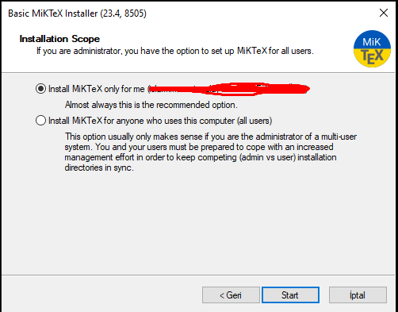

LaTeX Nedir?
Öz Geçmiş (CV), Tez, Bilimsel makaleler gibi bir çok dokümanın yazılmasında ve PDF formatında daha dinamik çıktılar almamıza olanak tanıyan bir standarttır.

Kurulum ve Kullanımı Aşağıda ki gibidir.

Miktex Kurulumu
https://miktex.org/download adresinden İşletim sisteminize uygun uygulamayı indirin.
Ben Windows için "basic-miktex-23.10-x64.exe" indirdim.
Aşağıda ki görüntüleri takip ederek kurulumu yapabilirsiniz.

1.

2.

3.

4.

5. (install missing packages on-the-fly "Yes" seçilmeli.)

6.

